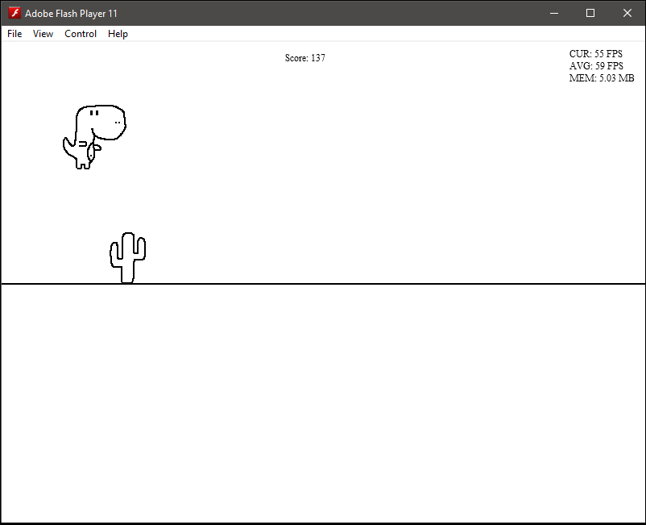

# DinoRunner-AS
A tiny/scuffed endless runner to learn the basics of ActionScript before Adobe Flash is completely put to rest.


I've never used ActionScript or Flash so I figured it'd be a shame if it died without ever learning a little about it.
I just spent a couple days screwing around with making a scuffed version of Chrome's dino runner game.





## Setting Up ActionScript Environment
* Download Apache Ant https://ant.apache.org/manual/install.html and add to PATH
* Install Apache Flex - https://www.apache.org/dyn/closer.lua/flex/installer/3.3.2/binaries/apache-flex-sdk-installer-3.3.2-bin.exe
* Add Apache Flex to PATH
* Change to install directory - ```cd D:\Development\apache-flex\bin```
* ```mkdir -p frameworks\libs\player\31.0\```
* Setup **playerglobal.swc**
  * Download from https://www.adobe.com/support/flashplayer/debug_downloads.html
  * place in **frameworks\libs\player\31.0**
  * my version numbers didn't match up, but I just renamed files to match and it worked lol ...
* ```ant -f installer.xml -Dair.sdk.version=2.6```


## References
* ActionScript 3 API Reference - https://help.adobe.com/en_US/FlashPlatform/reference/actionscript/3/
* https://riptutorial.com/actionscript-3
* https://gamedevelopment.tutsplus.com/articles/how-to-learn-flash-and-as3-for-game-development--gamedev-636
* http://edutechwiki.unige.ch/en/ActionScript_3_tutorials
